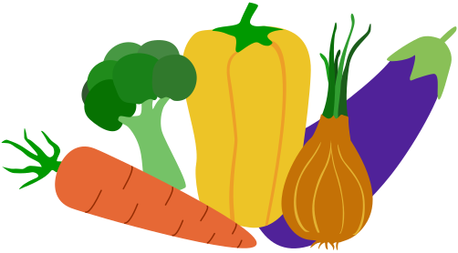

# Component library explorer

Garden is a lightweight UI explorer for Svelte projects that helps you build, test and display UI components and pages. Create design systems for Svelte projects.
<br><br>

## This is Garden

Garden is the showroom for what you grow. The explorer represents each component of your design system in isolation. The different states of the components are also shown. Garden is developed for Svelte projects of any size and runs outside of your app for an absolute independence. Code changes are reflected at the speed of light by the build tool Vite. Garden is an Open Source project under the MIT License.
<br><br>

## Getting Started

Create a new directory outside of the Svelte project and install Garden with NPM: [not yet, now: instead: checkout garden in garden base folder: 'npm link' or 'sudo npm link']

```bash
npm install --save-dev garden
```

Go to the root directory of your Svelte project:

```text
create rabbit.config.json file
```

Example configuration for your rabbit.config.json file:

```json
{
  "garden": {
    "serverport": 3010,
    "wssocketport": 3011,
    "destination": "garden/",
    "structure": {
      "custom": {
        "components": "/src/components/"
      }
    },
    "watch": {
      "directories": [
        "./src"
      ],
      "include": [
        ".svelte", ".das.json", ".scss", ".css", ".js"
      ]
    }
  }
}
```

Add those directories to "structure" > "custom" that are to be displayed on the first level of the Garden Navigation.

### Initialize Garden

Initialize Garden in the root of the project directory:

```bash
run initGarden
```

### Run Garden

Run `serveGarden` from the root of the Svelte project. Or add it to your `package.json` there and run it via `npm run garden` :

```json
  "scripts": {
    "garden": "serveGarden",
  },
```

### Open Garden

Open Garden in the browser via `http://localhost:<serverport>/garden`. The server port is defined in the `rabbit.config.json` file, e.g. 3010.
<br><br>

## Output of components (and pages) and add variants or states

In order to be able to output variants or states of components, you must create two additional files in the component directory:

With a `<component>.example.svelte` file you create all variants/states of the component. It then looks like this, for example:

```js
<script>
  import Button from './<component>.svelte'

  export let story
</script>

{#if story == 'story_1'}
<!-- code example -->

{:else if story == 'story_2'}
<!-- code example -->

{:else if story == 'story_3'}
<!-- code example -->

{/if}
```

Create a file `<component>.das.js` so that the variants/states are output in the panel and the navigation below the stage. In addition, a description or information about the component can be added here. It then looks like this, for example:

```js
export default {
  name: "<component>",
  file: "./<component>.example.svelte",
  description: "<A description/info of the component can be added here...>",
  examples: [
    {story: "<navigation title for story_1>", input: {story: "story_1"}},
    {story: "<navigation title for story_2>", input: {story: "story_2"}},
    {story: "<navigation title for story_3>", input: {story: "story_3"}},
  ]
}
```
<br>

## Svelte project kickstarter

Check out [Carrots](https://github.com/rabbitdevelopment/carrots) if you're interested in a fully customizable "hello world" Kickstarter for new Svelte project. Carrots is Garden ready out of the box.
<br><br>

## License

MIT
<br><br>

## Todo´s

### v1.0

* [task] Add Markdownfile to panel for infos. v1 or v1.1?
* [refactor] Move logic to own file. handle user interaction.
* [task] Show stage size in topbar.
* [task] Build kickstarter for new projects with own github repository (like carrots but just as "hello world).
* [task] check the error messages on the svelte files in the vs code (e.g. stage.svelte, gardenapp.svelte ...).
* [task] Set repository public & make garden npm modul. (yarn?)
* [feature] Manage project themes via topbar dropdown. Set "class dark" inside iframe if project has dark mode. Needs a Configuration file? Which Concepts are possible to realize that? in case of configuration file set field for project name/app name and put above sidebar nav next to collapse icon.

### v1.1

* [feature] screenshot-tests
* [feature] Make Garden compatible with Vue.
* [feature] Collapse panel button.
* [feature] Integrate Svelte A11y features.
* [bug] Prevent horizontal drag bar from slipping out of view when moving down.
* [feature] Improve Garden for smaller displays:
  * Sidebarnav is closed by default on narrow display devices.
  * ...
* [feature] Vertical dragbar to drag stage horizontical to show rwd behaviour. Already integrated staticly, just needs to be commented out in topbar.svelte: Show 'px' width/height of stage next to rwd-navi.
* [task] Build kickstarter "carrots". Define components for carrots.

<br><br><br><p align="center"></p>
